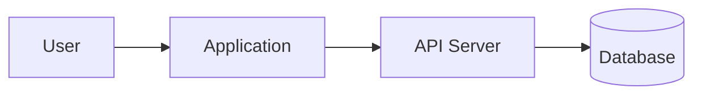
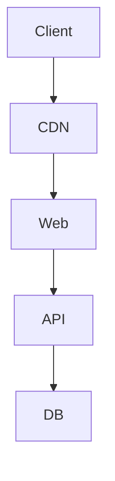

# System Architecture

- Feature/System:
- Owner: Architecture Team
- Created At: YYMMDDHH:mm:ss
- Updated At: YYMMDDHH:mm:ss
- Status: DRAFT / REVIEW / APPROVED

## 1. Architecture Summary

## 2. System Context

## 3. Components

| Component | Responsibility | Tech | Owner | Scaling Concern |
|---|---|---|---|---|
|  |  |  |  |  |

## 4. Data Flow

## 5. Deployment Architecture

## 6. Security Boundaries

- 

## 7. Observability

- Logs:
- Metrics:
- Alerts:

## 8. Risks

-
